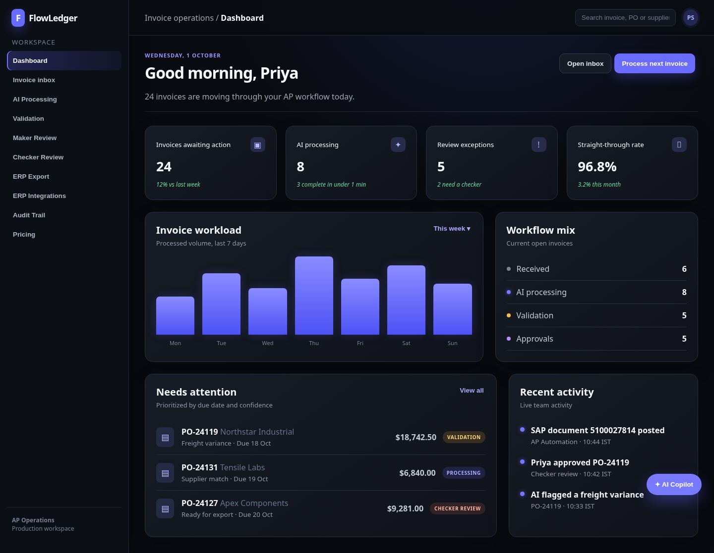
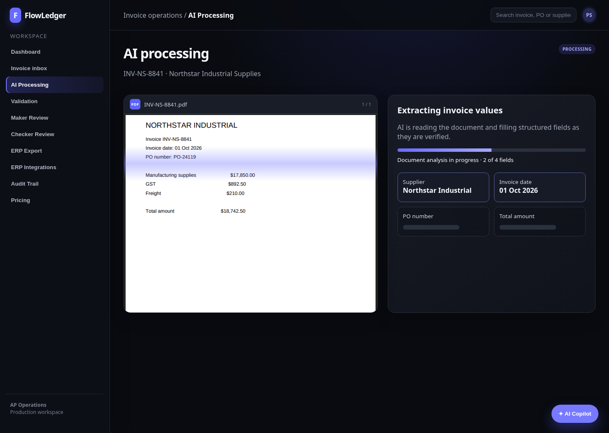
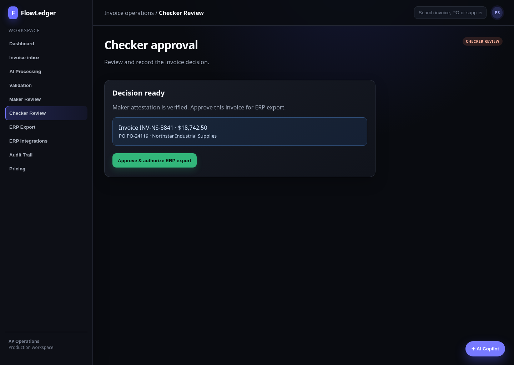
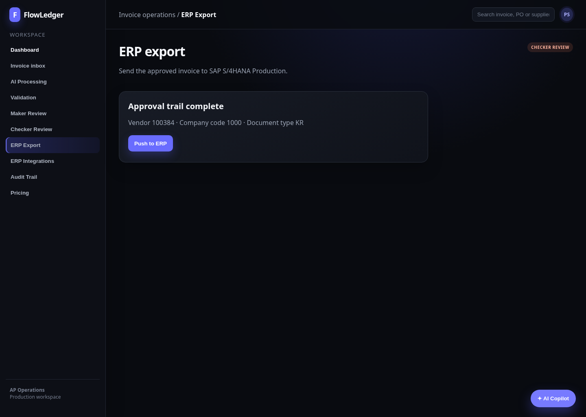

# FlowLedger

FlowLedger is an AI invoice-processing demo for accounts-payable teams. It follows an invoice from intake through extraction, validation, maker-checker approval, ERP export, and a complete audit trail.

The product is designed as a realistic operations workspace: users can inspect a purchase-order inbox, watch a sample invoice PDF be scanned, review extracted values, approve it in two steps, and send it to a simulated SAP S/4HANA export.

## Workflow

1. Open the dashboard to see workload, workflow mix, and invoices needing attention.
2. Select `PO-24119` from the invoice inbox and start AI Processing.
3. Watch the sample PDF scan while AI fills supplier, date, PO number, and total amount.
4. Complete business validation, maker review, and checker approval.
5. Push the approved invoice to the ERP export view and inspect its audit history.

## Screens

### Dashboard

The dashboard summarizes invoice volume, review exceptions, throughput, active workflow stages, and recent activity.



### AI processing

AI Processing displays a real sample PDF for `INV-NS-8841`. The scan animation runs over the document while matching invoice fields appear progressively.



### Checker approval

The second approval step confirms the maker attestation before an invoice can be authorized for export.



### ERP export

The ERP export screen represents the final handoff to SAP S/4HANA Production and links to the audit trail after posting.



## Features

- Invoice dashboard with workload, queue, and activity data
- Purchase-order inbox with realistic supplier and invoice records
- PDF-based AI extraction animation with field-by-field reveal
- Business validation and maker-checker approval controls
- Simulated SAP S/4HANA export and tamper-evident audit trail
- ERP integrations catalog and pricing page
- Global AI Copilot entry point
- Responsive dark SaaS interface with reduced-motion support

## Run locally

FlowLedger is a React app built with Vite.

```bash
npm install
npm run dev
```

Open the local URL shown by Vite. To create the production build, run:

```bash
npm run build
```

The build also generates the sample invoice PDF at `public/invoices/INV-NS-8841.pdf`.

## Project structure

```text
src/
  AppSaas.jsx          Application views and demo workflow state
  styles.css           Base layout and component styles
  dark-theme.css       Shared dark SaaS theme
  pdf-viewer.css       Invoice PDF viewer styling
scripts/
  create-sample-invoice-pdf.mjs
public/invoices/
  INV-NS-8841.pdf      Sample invoice used during AI Processing
docs/screenshots/      README product screenshots
```

## Demo data

The app uses fictional invoice and purchase-order data for demonstration. ERP connections and exports are simulated; no production finance system is contacted.
